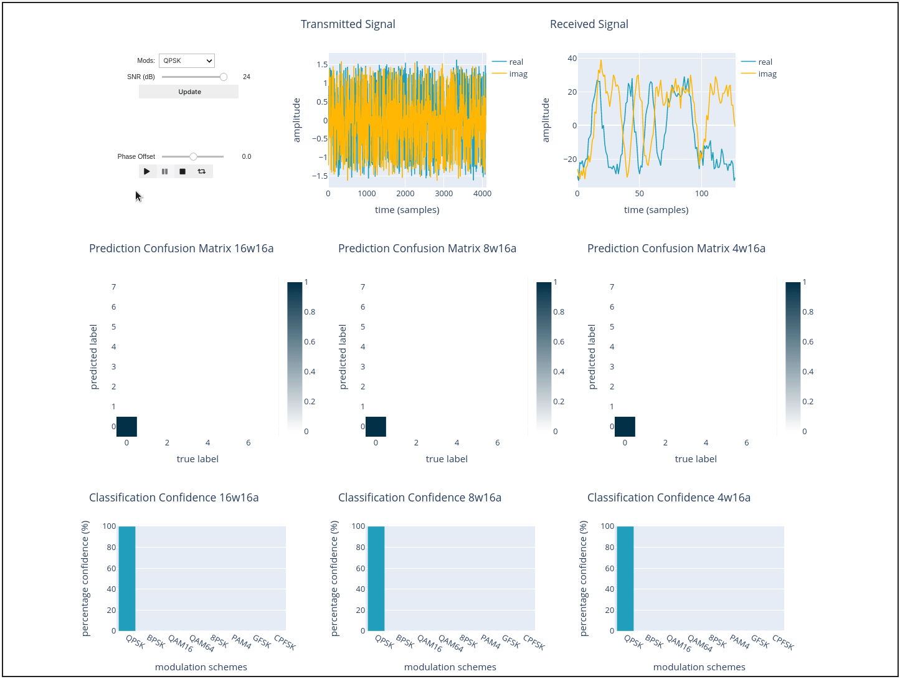

# RFSoC Quantised Automatic Modulation Classification
This project showcases the custom quantised CNN hardware inference architecture for wireless radio receivers like the AMD RFSoC.

The CNN model receives data samples from the RFSoC ADC and classifies the modulation scheme the received signal is encoded with.

**Comparing 3 levels of quantisation:**
- 16-bit weights & 16-bit activations
- 8-bit weights & 16-bit activations
- 4-bit weights & 16-bit activations

All models were trained in Quantised Aware Training (QAT) using [Brevitas](https://github.com/Xilinx/brevitas). Trained weights were exported into MATLAB & Simulink and the accelerator was built using HDL Coder.

The signal is received via an RF loopback cable connected to the RF-DAC on the same board. The modulates signal has been distorted by passing it through a simulated Rician multipath channel, adding Gaussian noise at levels ranging from -20dB to 24dB, and applying time, frequency, clock offsets.

## Installation
### Run Demo
To run the demo without building the bitstream, please do the following:
- Clone the project and copy the `rfsoc_quant_amc/` folder to the `jupyter_notebooks` folder on the RfSoC2x2 development board.
### Build Vivado project and bitstream
- After cloning the project, `cd rfsoc_quant_amc/boards/RFSoC2x2/`
- run `make all`
