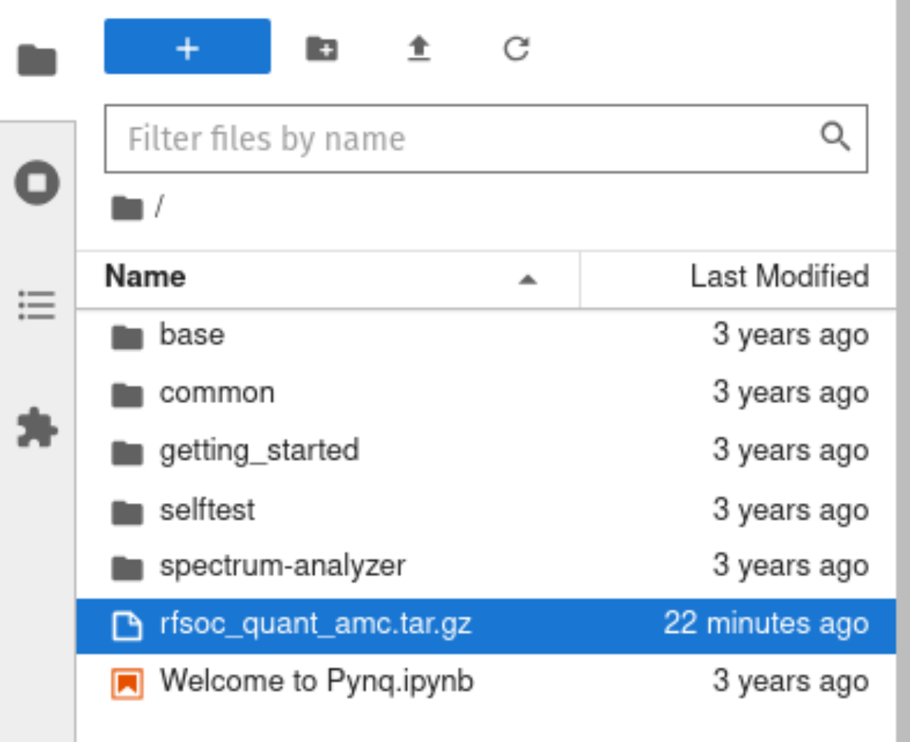

# RFSoC Quantised Automatic Modulation Classification
This project showcases the custom quantised CNN hardware inference architecture for SoC-based wireless radio receivers like the **AMD RFSoC**.

The CNN model receives data samples from the RFSoC ADC and classifies the modulation scheme the received signal is encoded with.

**Comparing 4 levels of quantisation:**
- 16-bit weights & 16-bit activations
- 8-bit weights & 16-bit activations
- 4-bit weights & 16-bit activations
- 2-bit weights & 16-bit activations

The demonstration shows a comparison between 4 models with different weight quantisations. The demo has two notebooks, one with models deployed with Post-Training Quantisation (PTQ) and another with the model's weights trained with Quantised-Aware Training (QAT) using [Brevitas](https://github.com/Xilinx/brevitas). Trained weights were exported into MATLAB & Simulink and the accelerator was built using [HDL Coder](https://uk.mathworks.com/products/hdl-coder.html).


The signal is received via an RF loopback cable connected to the RF-DAC. The modulates signal has been distorted by passing it through a simulated Rician multipath channel, adding Gaussian noise at levels ranging from -20dB to 24dB, and applying time, frequency, clock offsets.

Data set construction:


## 💻 Installation
### On the PC
The project should ideally be cloned onto a host PC first. This way the Git LFS file can be pulled properly.

1. Make sure you have Git LFS installed
```sh
sudo apt install git-lfs
```
2. Clone the repo
```sh
git clone https://github.com/axdy/rfsoc_quant_amc.git
```
3. Pull the LFS file (`transmit_test_SNR.pkl` ~580MB)
```sh
cd rfsoc_quant_amc
git lfs pull
git lfs checkout
```
4. Compress the project into a tar.gz
```sh
tar czf rfsoc_quant_amc.tar.gz --exclude=.git --exclude=.gitattributes -C "$(pwd)" .
```
5. Copy the tar file to the notebooks folder of the PYNQ session on the RFSoC. (Wait for the file to copy over!)



### On the RFSoC PYNQ Session
*Tested with PYNQ 3.0.1*

Open a terminal session and run:

6. Install the package
```sh
cd /home/xilinx/jupyter_notebooks
pip3 install rfsoc_quant_amc.tar.gz
```

7. Run the example notebooks within the `rfsoc_quant_amc` folder. Make sure the RFSoC is configured as described in [Hardware Setup](#hardware-setup)

## ⚙️ Hardware Setup
The demo performs best with a Nooelec VeGA Low-Noise Amplifier with a low-pass filter in loopback between DAC_A and ADC_A.

Board specific hardware setups: 
- [RFSoC2x2](./boards/RFSoC2x2/)
- [RFSoC4x2](./boards/RFSoC4x2/)

## 🧩 Vivado
The following software is required to use the project files in this repository.
- Vivado Design Suite 2020.2

This project can be built with Vivado from the command line. Open Vivado 2020.2 and execute the following into the tcl console:

`cd /<repository-location>/boards/<board-name>/rfsoc_quant_amc/`

Make the Vivado project by running the make commands below:
`make all`

# 📚 Publications
The work demonstrated in this repository has been published in the following paper:

>**Andrew Maclellan**,
> *"Streaming-based CNN Architecture for Physical Layer Wireless Receivers: Deployment-Oriented Dataset Generation and Quantisation Methods"*,
> PhD Thesis,
> [doi:10.48730/4b4r-2d95](https://doi.org/10.48730/4b4r-2d95)

> **Andrew Maclellan, Louise H. Crockett, and Robert W. Stewart**,  
> *"RFSoC Modulation Classification With Streaming CNN: Data Set Generation & Quantized-Aware Training,"*  
> IEEE Open Journal of Circuits and Systems, vol. 6, pp. 38–49, 2025.  
> [doi:10.1109/OJCAS.2024.3509627](https://doi.org/10.1109/OJCAS.2024.3509627)

If you use this repository, please **cite the above paper**.  
Formal citation metadata is also available via GitHub’s “Cite this repository” feature.

---

# ⚖️ License
BSD-3 Clause
