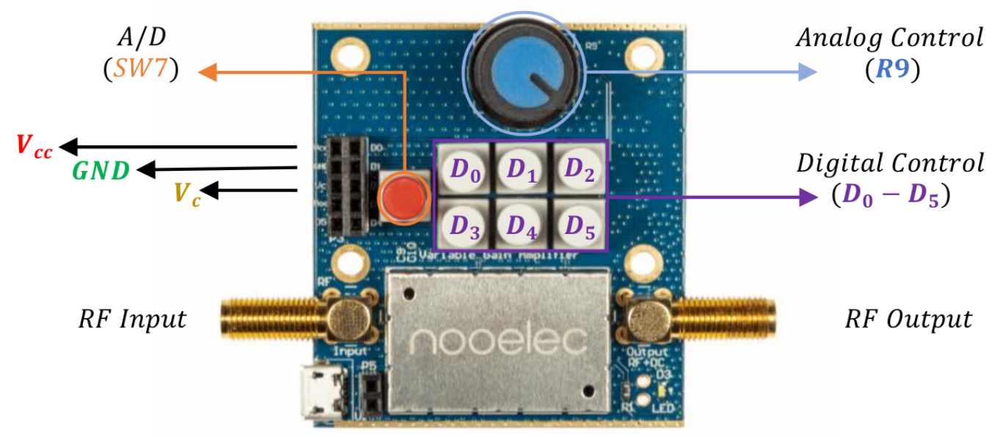

# Hardware Setup RFSoC2x2

The modulation classification demonstrator operates on real, transmitted and received signals. To facilitate signals being transmitted and received, the RFSoC board must be configured in loopback to send data from the DAC to the ADC.

## Nooelec VeGA Low-Noise Variable Gain Amplifier
The [Nooelec VeGA](https://www.nooelec.com/store/sdr/sdr-addons/rf-blocks/vega-barebones.html) is used to amplify the signal to maintain the signal integrity between the DAC and ADC. 

The VeGA should be configured with the following settings:

| Switches  | Position |
|-----------|----------|
| D0-D5     | OFF      |
| SW7 (A/D) | ON       |