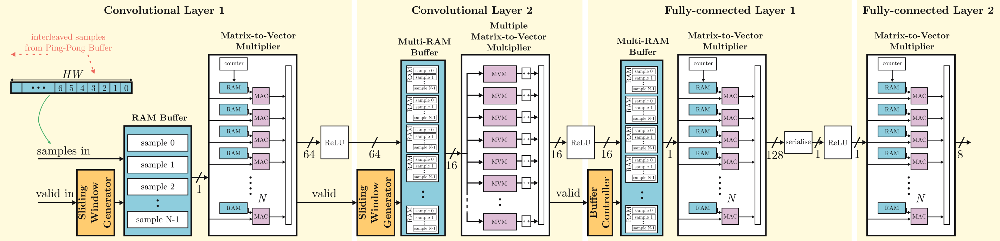

# MATLAB/Simulink AI Accelerator IP Core

This folder contains the MATLAB/Simulink files that were used to build each of the AI accelerator IP cores for implementing the modulation classification models trained in [train/](../train/).

## Tool Versions
Requirements:
- MATLAB 2020a (likely works with higher versions)
- Toolboxes:
    - HDL Coder Toolbox
    - Fixed-point designer

## Building the IP Core
Ensure that the model inputs and model weight `.mat` files are copied over from [train/](../train/). The scripts and models here will mostly work, but may require some tweaking to ensure the correct fractional bits are being used in the model.

Once you are happy that the correct precisions have been applied throughout the model you can begin the IP core generation:
1. Open simulink model (`model_cnn.slx`)
2. Right click `HDL_CNN_Model` -> HDL Coder -> HDL Workflow Advisor
3. Follow through the process ensuring that AXI4-Stream is used for the input and output data ports.

## High-level Diagram of AI Accelerator IP Core
The following diagram shows an overview of what the Simulink models are implementing:

More information about the implementation of the AI accelerator IP core can be found in the following paper by [Maclellan et al.](https://doi.org/10.1109/OJCAS.2024.3509627).
