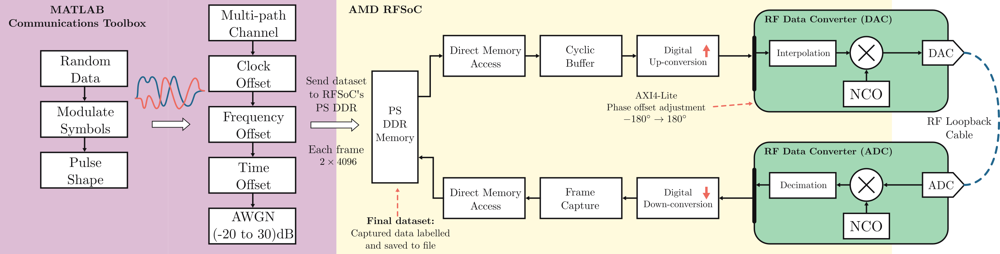

# Training Notebooks for Modulation Classification

This folder contains the notebooks used to train the models for performing modulation classification.

Notebooks exist that are used to train both Post-Training Quantisation (PTQ) and Quantised-Aware Training (QAT) models.

## Installing Dependancies
The dependancies are tracked with `poetry`. To install poetry please run:
```bash
curl -sSL https://install.python-poetry.org | python3 -
```
Once you have poetry installed, to install the dependancies run:
```bash
poetry install
```

...and add the poetry environment to the `ipykernel` list of kernels so that its usable in the notebooks:

```bash
poetry shell
python -m ipykernel install --user --name=amc_rfsoc --display-name "amc_rfsoc"
```

This Python environment should be available in the list of Jupyter kernels. Confirm with:
```bash
jupyter kernelspec list
```

## Dataset
The notebooks in this directory are all trained on the **DeepRFSoC** dataset. To install the dataset please download using the following command:
(This will take a while depending on internet connection).

```bash
git lfs install 
git clone https://huggingface.co/datasets/amaclellan/DeepRFSoC
```
Use the `deeprfsoc.pkl` inside the `DeepRFSoC/` folder to train the models.

### How was DeepRFSoC Generated?
Many wireless communications AI datasets are synthetically generated using tools such as GNU Radio or MATLAB. Synthetically generating signals allows for the simulation of over-the-air channel effects and noise. However, synthetically generated data does not fully encompass the distortions that have been applied to the signal from physically transmitting and receiving a signal induced by the hardware. For this reason, a combination of synthetically generated signals that were later transmitted and recorded were used to build the dataset. This way the signals received by the device will closely represent the signals the model was trained with.

A diagram of the dataset transmission is displayed below:


The modulation encoded signals are generated in MATLAB and transferred to the AMD RFSoC board. Using a DMA in cyclic mode [dma.py](https://github.com/Xilinx/PYNQ/blob/master/pynq/lib/dma.py), the synthetically generated signals are transmitted out of the RFSoC's DAC port, carried through a loopback cable and low-noise amplifier, into the RFSoC's ADC port where packets of the received signals are saved.

If you would like to generate the dataset yourself, the files are accessible in the `dataset_generation/`.

## After Training
Once training has been complete, the notebooks will produce `.mat` files for the inputs and weights. These should be transferred to be used by the MATLAB/Simulink models to generate the AI accelerator IP cores.
